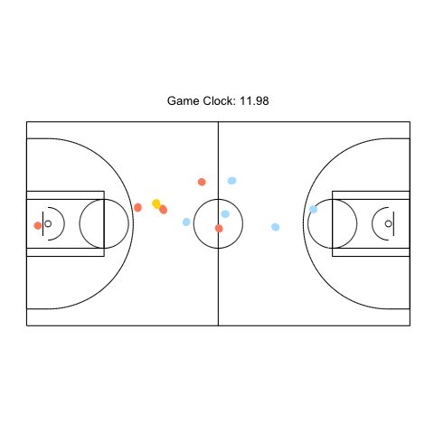
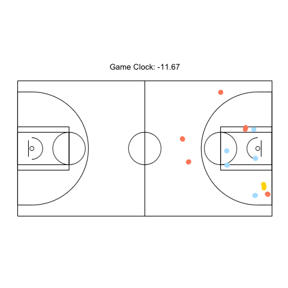
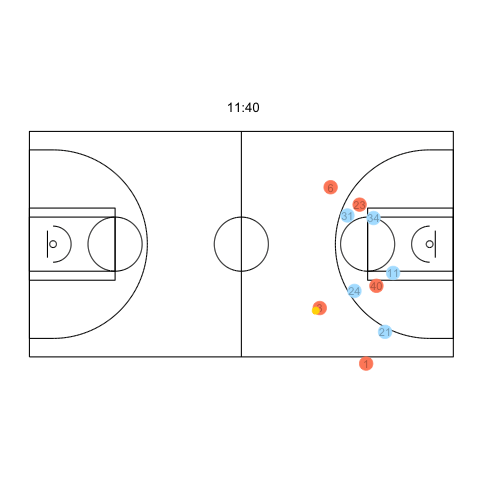
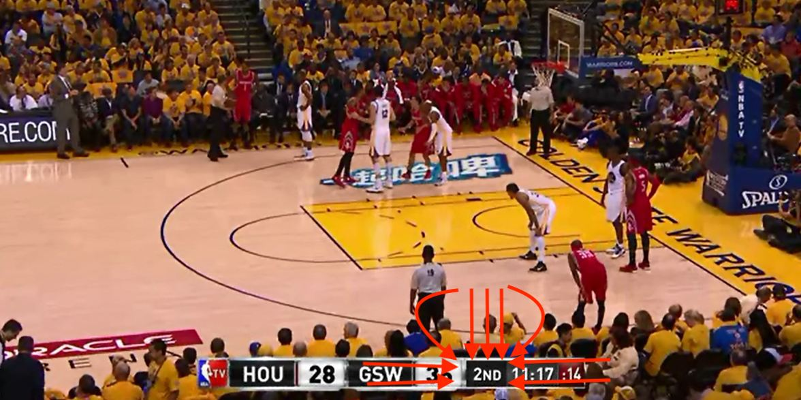
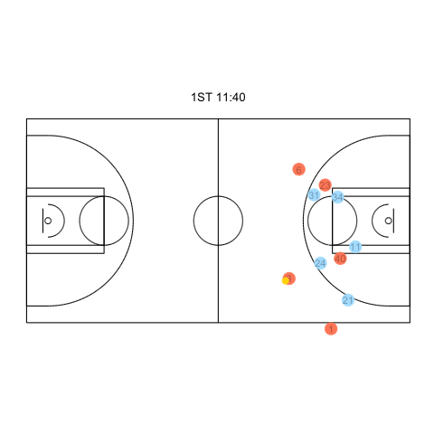
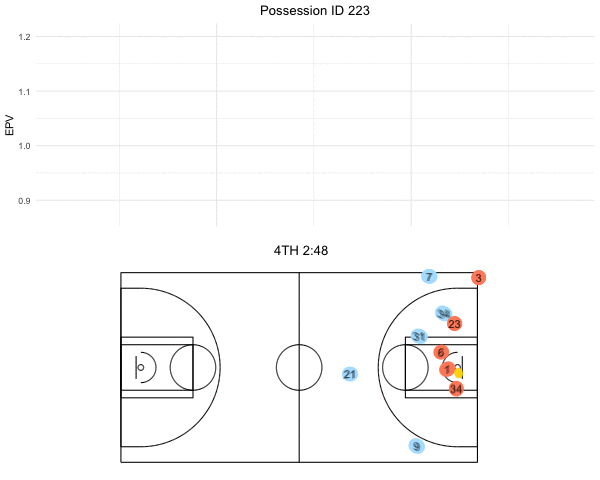
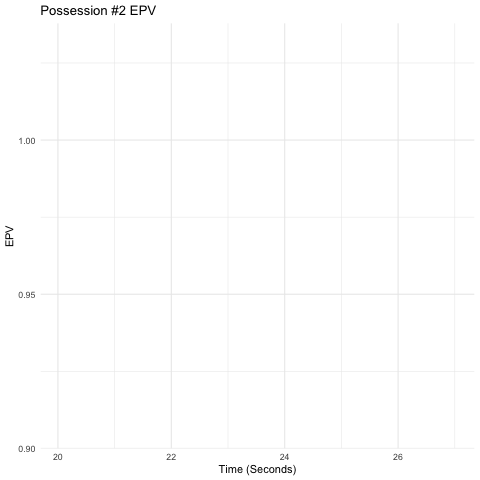

```{r setup, include=FALSE}
knitr::opts_chunk$set(echo = TRUE)
```

# Setup

```{r}
# Load Packages
library(tidyverse) # Data Manipulation
library(gganimate) # Animations
library(rvest) # Web Scraping
library(magick) # Image processing
library(ggrepel) # Texts in Graph 
theme_set(theme_minimal()) # Adjust theme of graphs
# Load Source Code: epv-demo-code.R (Takes 5 minutes)
```


# Glossary for Dataset

- `time`: Real time (seconds)

- `x,y,z`: Ball position on court in feet

- `Game Clock`: Time remaining in quarter (seconds)

- `h1~5_ent` / `a1~5_ent`: Player IDs on swishanalytics.com

- `epv.smooth`: EPV


# Create NBA Court

`Court Region`: [0, 94] X [0, 50] (Official NBA court is 94 feet by 50 feet)

Source: https://rpubs.com/jalapic/nbaplaybyplay

```{r}
#Forked from Ed K�pfer
#https://gist.github.com/edkupfer
#https://gist.github.com/asteves/7266330


fullcourt <- function () {
  
  palette(c("#E41A1C", "#377EB8", "#4DAF4A", "#984EA3",
            "#FF7F00", "#FFFF33", "#A65628", "#F781BF", 
            "#999999"))
  
  #Generate Data for the 3 point line
  # Define the circle; add a point at the center if the 'pie slice' if the shape is to be filled
  circleFun <- function(center=c(0,5.25), diameter=20.9, npoints=20000, start=0, end=1, filled=TRUE){
    tt <- seq(start*pi, end*pi, length.out=npoints)
    df <- data.frame(
      y = center[1] + diameter / 2 * cos(tt),
      x = center[2] + diameter / 2 * sin(tt)
    )
    return(df)
  }
  
  halfCircle <- circleFun(c(0, 5.25), 20.9*2, start=0, end=1, filled=FALSE)
  
  ggplot(data=data.frame(y=1,x=1),aes(x,y))+
    ###halfcourt line:
    geom_path(data=data.frame(x=c(47,47),y=c(0,50)))+
    ###outside boy:
    geom_path(data=data.frame(y=c(0,0,50,50,0),x=c(0,94,94,0,0)))+
    ###solid FT semicircle above FT line:
    geom_path(data=data.frame(y=c((-6000:(-1)/1000)+25,(1:6000/1000)+25),x=c(19+sqrt(6^2-c(-6000:(-1)/1000,1:6000/1000)^2))),aes(y=y,x=x))+
    geom_path(data=data.frame(y=c((-6000:(-1)/1000)+25,(1:6000/1000)+25),x=c(75+sqrt(6^2-c(-6000:(-1)/1000,1:6000/1000)^2))),aes(y=y,x=x))+
    ###dashed FT semicircle below FT line:
    geom_path(data=data.frame(y=c((-6000:(-1)/1000)+25,(1:6000/1000)+25),x=c(19-sqrt(6^2-c(-6000:(-1)/1000,1:6000/1000)^2))),aes(y=y,x=x),linetype='dashed')+
    geom_path(data=data.frame(y=c((-6000:(-1)/1000)+25,(1:6000/1000)+25),x=c(75-sqrt(6^2-c(-6000:(-1)/1000,1:6000/1000)^2))),aes(y=y,x=x),linetype='dashed')+
    ###kex:
    geom_path(data=data.frame(y=c(17,17,33,33,17),x=c(0,19,19,0,0)))+
    geom_path(data=data.frame(y=c(17,17,33,33,17),x=c(94,75,75,94,94)))+
    ###boy inside the kex:
    geom_path(data=data.frame(y=c(19,19,31,31,19),x=c(0,19,19,0,0)))+
    geom_path(data=data.frame(y=c(19,19,31,31,19),x=c(94,75,75,94,94)))+
    ###restricted area semicircle:
    geom_path(data=data.frame(y=c((-4000:(-1)/1000)+25,(1:4000/1000)+25),x=c(5.25+sqrt(4^2-c(-4000:(-1)/1000,1:4000/1000)^2))),aes(y=y,x=x))+
    geom_path(data=data.frame(y=c((-4000:(-1)/1000)+25,(1:4000/1000)+25),x=c(88.75-sqrt(4^2-c(-4000:(-1)/1000,1:4000/1000)^2))),aes(y=y,x=x))+
    ###halfcourt semicircle:
    geom_path(data=data.frame(y=c((-6000:(-1)/1000)+25,(1:6000/1000)+25),x=c(47-sqrt(6^2-c(-6000:(-1)/1000,1:6000/1000)^2))),aes(y=y,x=x))+
    geom_path(data=data.frame(y=c((-6000:(-1)/1000)+25,(1:6000/1000)+25),x=c(47+sqrt(6^2-c(-6000:(-1)/1000,1:6000/1000)^2))),aes(y=y,x=x))+
    ###rim:
    geom_path(data=data.frame(y=c((-750:(-1)/1000)+25,(1:750/1000)+25,(750:1/1000)+25,(-1:-750/1000)+25),x=c(c(5.25+sqrt(0.75^2-c(-750:(-1)/1000,1:750/1000)^2)),c(5.25-sqrt(0.75^2-c(750:1/1000,-1:-750/1000)^2)))),aes(y=y,x=x))+
    geom_path(data=data.frame(y=c((-750:(-1)/1000)+25,(1:750/1000)+25,(750:1/1000)+25,(-1:-750/1000)+25),x=c(c(88.75+sqrt(0.75^2-c(-750:(-1)/1000,1:750/1000)^2)),c(88.75-sqrt(0.75^2-c(750:1/1000,-1:-750/1000)^2)))),aes(y=y,x=x))+
    ###backboard:
    geom_path(data=data.frame(y=c(22,28),x=c(4,4)),lineend='butt')+
    geom_path(data=data.frame(y=c(22,28),x=c(90,90)),lineend='butt')+
    ###three-point line:
    # geom_path(data=data.frame(y=c(-21,-21,-21000:(-1)/1000,1:21000/1000,21,21),x=c(0,169/12,5.25+sqrt(23.75^2-c(-21000:(-1)/1000,1:21000/1000)^2),169/12,0)),aes(y=y,x=x))+
    ###fiy aspect ratio to 1:1
    geom_path(data=halfCircle,aes(x=x,y=y+25))+
    ###Complete the three-point line 
    geom_path(data=data.frame(y=c(4.1,4.1,45.9,45.9),x=c(5.25,0,0,5.25)))+
    geom_path(data=halfCircle,aes(x=94-x,y=y+25))+
    geom_path(data=data.frame(y=c(4.1,4.1,45.9,45.9),x=c(88.75,94,94,88.75)))+
    coord_fixed()+
    
    ###Clean up the Court 
    theme_bw()+theme(panel.grid=element_blank(), legend.title=element_blank(), panel.border=element_blank(),axis.text=element_blank(),axis.ticks=element_blank(),axis.title=element_blank(),legend.position="top")}
```


```{r}
fullcourt()
```


# Grab Jersey Numbers

Source: www.swishanalytics.com

`XX_ent`: Id number

You can find more info (jersey number, height, age, etc) on each id number (player) using https://www.swishanalytics.com/nba/players/player?id=61849

```{r}
# Define rvest function to extract jersey number
grab_jersey <- function(player_id) {
  
  swish_url <- paste0("https://www.swishanalytics.com/nba/players/player?id=", player_id)
  
  swish <- read_html(swish_url)
  
  result <- swish %>% 
    html_node(".mobile-hide") %>%
    html_text() %>% 
    # Extract out numeric
    parse_number()
  
  result
}
```


# Next Step

Now that I have created a `full_court` (94 feet by 50 feet), I can add on points with geom_point(): `full_court + geom_point()`. These points will represent all 10 players on the court and the ball.

```{r}
# Make dataset for first possession
first_poss <- e.dat %>% 
  filter(possID == 1)
```


# Plot ball movement in one possession (possID == 1)
```{r}
# Ball Movement
fullcourt() +
  geom_path(data = first_poss, aes(x = x, y = y ,group = possID), size=6) +  
  theme(legend.position="none") 
```

# Plot one possession (possID == 1) for ALL PLAYERS + BALL
```{r}
fullcourt() +
  geom_point(data = first_poss, aes(x = h1_x, y = h1_y, group = possID), size=3, color = "salmon1") +  
  geom_point(data = first_poss, aes(x = h2_x, y = h2_y, group = possID), size=3, color = "lightskyblue1") +  
  geom_point(data = first_poss, aes(x = h3_x, y = h3_y, group = possID), size=3, color = "yellow") +  
  geom_point(data = first_poss, aes(x = h4_x, y = h4_y, group = possID), size=3, color = "orange") +  
  geom_point(data = first_poss, aes(x = h5_x, y = h5_y, group = possID), size=3, color = "green") +  
  
  geom_point(data = first_poss, aes(x = a1_x, y = a1_y, group = possID), size=3, color = "salmon1") +  
  geom_point(data = first_poss, aes(x = a2_x, y = a2_y, group = possID), size=3, color = "lightskyblue1") +  
  geom_point(data = first_poss, aes(x = a3_x, y = a3_y, group = possID), size=3, color = "yellow") +  
  geom_point(data = first_poss, aes(x = a4_x, y = a4_y, group = possID), size=3, color = "orange") +  
  geom_point(data = first_poss, aes(x = a5_x, y = a5_y, group = possID), size=3, color = "green") +  
  geom_point(data = first_poss, aes(x = x, y = y, group = possID), size=3, color = "gold") +  
  theme(legend.position="none") 
```


- Really hard to differentiate which players are on which team so I use colors to distinguish them


# Initial Animation
```{r}
a <- fullcourt() +
  geom_point(data = first_poss, aes(x = h1_x, y = h1_y, group = possID), size=3, color = "lightskyblue1") +  
  geom_point(data = first_poss, aes(x = h2_x, y = h2_y, group = possID), size=3, color = "lightskyblue1") +  
  geom_point(data = first_poss, aes(x = h3_x, y = h3_y, group = possID), size=3, color = "lightskyblue1") +  
  geom_point(data = first_poss, aes(x = h4_x, y = h4_y, group = possID), size=3, color = "lightskyblue1") +  
  geom_point(data = first_poss, aes(x = h5_x, y = h5_y, group = possID), size=3, color = "lightskyblue1") +  
  geom_point(data = first_poss, aes(x = a1_x, y = a1_y, group = possID), size=3, color = "salmon1") +  
  geom_point(data = first_poss, aes(x = a2_x, y = a2_y, group = possID), size=3, color = "salmon1") +  
  geom_point(data = first_poss, aes(x = a3_x, y = a3_y, group = possID), size=3, color = "salmon1") +  
  geom_point(data = first_poss, aes(x = a4_x, y = a4_y, group = possID), size=3, color = "salmon1") +  
  geom_point(data = first_poss, aes(x = a5_x, y = a5_y, group = possID), size=3, color = "salmon1") +  
  geom_point(data = first_poss, aes(x = x, y = y, group = possID), size=3, color = "gold") +
  ############################################
  #### Here comes the gganimate code##########
  ############################################  
  transition_time(time = -game_clock) +
  ggtitle("Game Clock: {round(-frame_time / 60, 2)}") +
  theme(plot.title = element_text(hjust = 0.5))
```

```{r, out.width = "580px", out.height = "300px", echo = FALSE}

```


```{r, out.width = "580px", out.height = "300px", echo = FALSE}

```


Used sky blue to show home team players and Salmon color to show away team players. Ball is in gold. Importantly, transition_time(time = -game_clock)  so that we transition in time in a decreasing order. 


# Second Possession

- Incorporate jersey numbers

```{r}
# Filter out for last possession ID
second_poss <- e.dat %>% 
  filter(possID == 2)

# Define rvest function to extract jersey number
grab_jersey <- function(player_id) {
  
  swish_url <- paste0("https://www.swishanalytics.com/nba/players/player?id=", player_id)
  
  swish <- read_html(swish_url)
  
  result <- swish %>% 
    html_node(".mobile-hide") %>%
    html_text() %>% 
    # Extract out numeric
    parse_number()
  
  result
}


# Replace _ent with jersey numbers
a1_ent_jersey <- second_poss %>% 
  pull(a1_ent) %>%
  first() %>% 
  grab_jersey()

a2_ent_jersey <- second_poss %>% 
  pull(a2_ent) %>%
  first() %>% 
  grab_jersey()

a3_ent_jersey <- second_poss %>% 
  pull(a3_ent) %>%
  first() %>% 
  grab_jersey()

a4_ent_jersey <- second_poss %>% 
  pull(a4_ent) %>%
  first() %>% 
  grab_jersey()

a5_ent_jersey <- second_poss %>% 
  pull(a5_ent) %>%
  first() %>% 
  grab_jersey()

h1_ent_jersey <- second_poss %>% 
  pull(h1_ent) %>%
  first() %>% 
  grab_jersey()

h2_ent_jersey <- second_poss %>% 
  pull(h2_ent) %>%
  first() %>% 
  grab_jersey()

h3_ent_jersey <- second_poss %>% 
  pull(h3_ent) %>%
  first() %>% 
  grab_jersey()

h4_ent_jersey <- second_poss %>% 
  pull(h4_ent) %>%
  first() %>% 
  grab_jersey()

h5_ent_jersey <- second_poss %>% 
  pull(h5_ent) %>%
  first() %>% 
  grab_jersey()

# Mutate jersey number columns
second_poss <- second_poss %>% 
  mutate(a1_ent_jersey = a1_ent_jersey,
         a2_ent_jersey = a2_ent_jersey,
         a3_ent_jersey = a3_ent_jersey,
         a4_ent_jersey = a4_ent_jersey,
         a5_ent_jersey = a5_ent_jersey,
         h1_ent_jersey = h1_ent_jersey,
         h2_ent_jersey = h2_ent_jersey,
         h3_ent_jersey = h3_ent_jersey,
         h4_ent_jersey = h4_ent_jersey,
         h5_ent_jersey = h5_ent_jersey)


second_poss_anim <- fullcourt() +
  # Home Players + Jersey Numbers
  geom_point(data = second_poss, aes(x = h1_x, y = h1_y, group = possID), size = 6, color = "lightskyblue1") +  
  geom_text(data = second_poss, aes(x = h1_x, y = h1_y, group = possID, label = h1_ent_jersey), color = 'black', alpha = 0.3) + 
  
   geom_point(data = second_poss, aes(x = h2_x, y = h2_y, group = possID), size = 6, color = "lightskyblue1") +  
  geom_text(data = second_poss, aes(x = h2_x, y = h2_y, group = possID, label = h2_ent_jersey), color = 'black', alpha = 0.3) + 
  
  geom_point(data = second_poss, aes(x = h3_x, y = h3_y, group = possID), size = 6, color = "lightskyblue1") +  
  
  geom_text(data = second_poss, aes(x = h3_x, y = h3_y, group = possID, label = h3_ent_jersey), color = 'black', alpha = 0.3) + 
  
  geom_point(data = second_poss, aes(x = h4_x, y = h4_y, group = possID), size = 6, color = "lightskyblue1") +  
  
  geom_text(data = second_poss, aes(x = h4_x, y = h4_y, group = possID, label = h4_ent_jersey), color = 'black', alpha = 0.3) + 
  
  geom_point(data = second_poss, aes(x = h5_x, y = h5_y, group = possID), size = 6, color = "lightskyblue1") + 
  
  geom_text(data = second_poss, aes(x = h5_x, y = h5_y, group = possID, label = h5_ent_jersey), color = 'black', alpha = 0.3) + 
  
  # Away Players
  geom_point(data = second_poss, aes(x = a1_x, y = a1_y, group = possID), size = 6, color = "salmon1") +  
  geom_text(data = second_poss, aes(x = a1_x, y = a1_y, group = possID, label = a1_ent_jersey), color = 'black', alpha = 0.3) + 
  
  geom_point(data = second_poss, aes(x = a2_x, y = a2_y, group = possID), size = 6, color = "salmon1") +  
  geom_text(data = second_poss, aes(x = a2_x, y = a2_y, group = possID, label = a2_ent_jersey), color = 'black', alpha = 0.3) + 
  
  geom_point(data = second_poss, aes(x = a3_x, y = a3_y, group = possID), size = 6, color = "salmon1") +  
  geom_text(data = second_poss, aes(x = a3_x, y = a3_y, group = possID, label = a3_ent_jersey), color = 'black', alpha = 0.3) + 
  
  geom_point(data = second_poss, aes(x = a4_x, y = a4_y, group = possID), size = 6, color = "salmon1") +  
  geom_text(data = second_poss, aes(x = a4_x, y = a4_y, group = possID, label = a4_ent_jersey), color = 'black', alpha = 0.3) + 
  
  geom_point(data = second_poss, aes(x = a5_x, y = a5_y, group = possID), size = 6, color = "salmon1") +  
  geom_text(data = second_poss, aes(x = a5_x, y = a5_y, group = possID, label = a5_ent_jersey), color = 'black', alpha = 0.3) + 
  
  # Ball
  geom_point(data = second_poss, aes(x = x, y = y, group = possID), size = 3, color = "gold") +
  
  transition_time(time = -game_clock) +
  ggtitle(paste0(" ",  "{-frame_time %/% 60}", ":", "{round(-frame_time %% 60, 0)}")) +
  theme(plot.title = element_text(hjust = 0.5))
```


```{r, out.width = "580px", out.height = "300px", echo = FALSE}

```


# Animation with NBA-Broadcast Game Clock


```{r, out.width = "580px", out.height = "300px", echo = FALSE}

```


- Include Quarter in Title

```{r}
second_poss <- second_poss %>% 
  mutate(quarter_processed = case_when(
    quarter == 1 ~ "1ST",
    quarter == 2 ~ "2ND",
    quarter == 3 ~ "3RD",
    quarter == 4 ~ "4TH",
    TRUE ~ "NA"
  )) %>% 
  mutate(game_clock_minutes = game_clock %/% 60) %>% 
  mutate(game_clock_seconds = game_clock %% 60)

second_poss_quarter <- second_poss %>% 
  pull(quarter_processed) %>% 
  first()

second_poss_final <- fullcourt() +
  # Home Players + Jersey Numbers
  geom_point(data = second_poss, aes(x = h1_x, y = h1_y, group = possID), size = 6, color = "lightskyblue1") +  
  geom_text(data = second_poss, aes(x = h1_x, y = h1_y, group = possID, label = h1_ent_jersey), color = 'black', alpha = 0.3) + 
  
   geom_point(data = second_poss, aes(x = h2_x, y = h2_y, group = possID), size = 6, color = "lightskyblue1") +  
  geom_text(data = second_poss, aes(x = h2_x, y = h2_y, group = possID, label = h2_ent_jersey), color = 'black', alpha = 0.3) + 
  
  geom_point(data = second_poss, aes(x = h3_x, y = h3_y, group = possID), size = 6, color = "lightskyblue1") +  
  
  geom_text(data = second_poss, aes(x = h3_x, y = h3_y, group = possID, label = h3_ent_jersey), color = 'black', alpha = 0.3) + 
  
  geom_point(data = second_poss, aes(x = h4_x, y = h4_y, group = possID), size = 6, color = "lightskyblue1") +  
  
  geom_text(data = second_poss, aes(x = h4_x, y = h4_y, group = possID, label = h4_ent_jersey), color = 'black', alpha = 0.3) + 
  
  geom_point(data = second_poss, aes(x = h5_x, y = h5_y, group = possID), size = 6, color = "lightskyblue1") + 
  
  geom_text(data = second_poss, aes(x = h5_x, y = h5_y, group = possID, label = h5_ent_jersey), color = 'black', alpha = 0.3) + 
  
  # Away Players
  geom_point(data = second_poss, aes(x = a1_x, y = a1_y, group = possID), size = 6, color = "salmon1") +  
  geom_text(data = second_poss, aes(x = a1_x, y = a1_y, group = possID, label = a1_ent_jersey), color = 'black', alpha = 0.3) + 
  
  geom_point(data = second_poss, aes(x = a2_x, y = a2_y, group = possID), size = 6, color = "salmon1") +  
  geom_text(data = second_poss, aes(x = a2_x, y = a2_y, group = possID, label = a2_ent_jersey), color = 'black', alpha = 0.3) + 
  
  geom_point(data = second_poss, aes(x = a3_x, y = a3_y, group = possID), size = 6, color = "salmon1") +  
  geom_text(data = second_poss, aes(x = a3_x, y = a3_y, group = possID, label = a3_ent_jersey), color = 'black', alpha = 0.3) + 
  
  geom_point(data = second_poss, aes(x = a4_x, y = a4_y, group = possID), size = 6, color = "salmon1") +  
  geom_text(data = second_poss, aes(x = a4_x, y = a4_y, group = possID, label = a4_ent_jersey), color = 'black', alpha = 0.3) + 
  
  geom_point(data = second_poss, aes(x = a5_x, y = a5_y, group = possID), size = 6, color = "salmon1") +  
  geom_text(data = second_poss, aes(x = a5_x, y = a5_y, group = possID, label = a5_ent_jersey), color = 'black', alpha = 0.3) + 
  
  # Ball
  geom_point(data = second_poss, aes(x = x, y = y, group = possID), size = 3, color = "gold") +
  
  transition_time(time = -game_clock) +
   ggtitle(paste0(second_poss_quarter, " ",  "{-frame_time %/% 60}", ":", "{round(-frame_time %% 60, 0)}")) +
  theme(plot.title = element_text(hjust = 0.5))

anim_save("second_poss_final.GIF", animate(second_poss_final, fps = 8))
```


```{r, out.width = "580px", out.height = "300px", echo = FALSE}

```


# Let's look at the second part: EPV curves


# EPV Curves

```{r, out.width = "580px", out.height = "300px", echo = FALSE}

```


# Animate EPV curve using `e.dat` from epv-demo-code.Rmd
```{r}
epv_curve <- e.dat %>% 
  filter(possID == 2)

epv_curve_2_anim <- epv_curve %>% 
  ggplot(aes(x = 720 - game_clock, y = epv.smooth)) +
  geom_path() +
  ## Here comes the gganimate code ## 
  transition_reveal(720 - game_clock) + 
  labs(x = "Time (Seconds)",
       y = "EPV",
       title = "Possession #2 EPV") 
```


```{r, out.width = "580px", out.height = "300px", echo = FALSE}

```


# Notes about EPV Curves

- Gotta use `epv.smooth` on y-axis because its a lot smoother than `epv`

- We use transition_reveal() to allow the lines to gradually be build up. transition_reveal() knows to only keep old data for path and polygon type layers which means that our segment, point, and text layers only appears as single data points in each frame


# Overall Function that combines PBP and EPV Line Charts


```{r}
make_poss_gif <- function(poss_num) {
  
  e.dat <- e.dat %>% 
  filter(possID == 231)

# Replace _ent with jersey numbers
a1_ent_jersey <- e.dat %>% 
  pull(a1_ent) %>%
  first() %>% 
  grab_jersey()

a2_ent_jersey <- e.dat %>% 
  pull(a2_ent) %>%
  first() %>% 
  grab_jersey()

a3_ent_jersey <- e.dat %>% 
  pull(a3_ent) %>%
  first() %>% 
  grab_jersey()

a4_ent_jersey <- e.dat %>% 
  pull(a4_ent) %>%
  first() %>% 
  grab_jersey()

a5_ent_jersey <- e.dat %>% 
  pull(a5_ent) %>%
  first() %>% 
  grab_jersey()

h1_ent_jersey <- e.dat %>% 
  pull(h1_ent) %>%
  first() %>% 
  grab_jersey()

h2_ent_jersey <- e.dat %>% 
  pull(h2_ent) %>%
  first() %>% 
  grab_jersey()

h3_ent_jersey <- e.dat %>% 
  pull(h3_ent) %>%
  first() %>% 
  grab_jersey()

h4_ent_jersey <- e.dat %>% 
  pull(h4_ent) %>%
  first() %>% 
  grab_jersey()

h5_ent_jersey <- e.dat %>% 
  pull(h5_ent) %>%
  first() %>% 
  grab_jersey()

# Mutate jersey number columns
e.dat <- e.dat %>% 
  mutate(a1_ent_jersey = a1_ent_jersey,
         a2_ent_jersey = a2_ent_jersey,
         a3_ent_jersey = a3_ent_jersey,
         a4_ent_jersey = a4_ent_jersey,
         a5_ent_jersey = a5_ent_jersey,
         h1_ent_jersey = h1_ent_jersey,
         h2_ent_jersey = h2_ent_jersey,
         h3_ent_jersey = h3_ent_jersey,
         h4_ent_jersey = h4_ent_jersey,
         h5_ent_jersey = h5_ent_jersey) %>% 
  mutate(quarter_processed = case_when(
    quarter == 1 ~ "1ST",
    quarter == 2 ~ "2ND",
    quarter == 3 ~ "3RD",
    quarter == 4 ~ "4TH",
    TRUE ~ "NA"
  )) %>% 
  mutate(game_clock_minutes = game_clock %/% 60) %>% 
  mutate(game_clock_seconds = game_clock %% 60)


possid_quarter <- e.dat %>% 
  pull(quarter_processed) %>% 
  first()


# Save animation as object
anim <- fullcourt() +
  # Home Players + Jersey Numbers
  geom_point(data = e.dat, aes(x = h1_x, y = h1_y, group = possID), size = 6, color = "lightskyblue1") +  
  geom_text(data = e.dat, aes(x = h1_x, y = h1_y, group = possID, label = h1_ent_jersey), color = 'black', alpha = 0.3) + 
  
  geom_point(data = e.dat, aes(x = h2_x, y = h2_y, group = possID), size = 6, color = "lightskyblue1") +  
  geom_text(data = e.dat, aes(x = h2_x, y = h2_y, group = possID, label = h2_ent_jersey), color = 'black', alpha = 0.3) + 
  
  geom_point(data = e.dat, aes(x = h3_x, y = h3_y, group = possID), size = 6, color = "lightskyblue1") +  
  geom_text(data = e.dat, aes(x = h3_x, y = h3_y, group = possID, label = h3_ent_jersey), color = 'black', alpha = 0.3) + 
  
  geom_point(data = e.dat, aes(x = h4_x, y = h4_y, group = possID), size = 6, color = "lightskyblue1") +  
  geom_text(data = e.dat, aes(x = h4_x, y = h4_y, group = possID, label = h4_ent_jersey), color = 'black', alpha = 0.3) + 
  
  geom_point(data = e.dat, aes(x = h5_x, y = h5_y, group = possID), size = 6, color = "lightskyblue1") + 
  geom_text(data = e.dat, aes(x = h5_x, y = h5_y, group = possID, label = h5_ent_jersey), color = 'black', alpha = 0.3) + 
  
  # Away Players
  geom_point(data = e.dat, aes(x = a1_x, y = a1_y, group = possID), size = 6, color = "salmon1") +  
  geom_text(data = e.dat, aes(x = a1_x, y = a1_y, group = possID, label = a1_ent_jersey), color = 'black', alpha = 0.3) + 
  
  geom_point(data = e.dat, aes(x = a2_x, y = a2_y, group = possID), size = 6, color = "salmon1") +  
  geom_text(data = e.dat, aes(x = a2_x, y = a2_y, group = possID, label = a2_ent_jersey), color = 'black', alpha = 0.3) + 
  
  geom_point(data = e.dat, aes(x = a3_x, y = a3_y, group = possID), size = 6, color = "salmon1") +  
  geom_text(data = e.dat, aes(x = a3_x, y = a3_y, group = possID, label = a3_ent_jersey), color = 'black', alpha = 0.3) + 
  
  geom_point(data = e.dat, aes(x = a4_x, y = a4_y, group = possID), size = 6, color = "salmon1") +  
  geom_text(data = e.dat, aes(x = a4_x, y = a4_y, group = possID, label = a4_ent_jersey), color = 'black', alpha = 0.3) + 
  
  geom_point(data = e.dat, aes(x = a5_x, y = a5_y, group = possID), size = 6, color = "salmon1") +  
  geom_text(data = e.dat, aes(x = a5_x, y = a5_y, group = possID, label = a5_ent_jersey), color = 'black', alpha = 0.3) + 
  
  # Ball
  geom_point(data = e.dat, aes(x = x, y = y, group = possID), size = 3, color = "gold") +
  
  transition_time(time = -game_clock) +
  ggtitle(paste0(possid_quarter, " ",  "{-frame_time %/% 60}", ":", "{round(-frame_time %% 60, 0)}")) +
  theme(plot.title = element_text(hjust = 0.5))


epv_curve <-  e.dat %>%  
  mutate_at(vars(contains("event")), 
            funs(case_when(
              . == 1 ~ "Free Throw Made",
              . == 2 ~ "Free Throw Missed",
              . == 3 ~ "Shot Made",
              . == 4 ~ "Shot Missed",
              . == 5 ~ "Offensive Rebound",
              . == 6 ~ "Defensive Rebound",
              . == 7 ~ "Turnover",
              . == 8 ~ "Foul",
              . == 9 ~ "Violation",
              . == 10 ~ "Substitution",
              . == 11 ~ "Timeout",
              . == 12 ~ "Jump Ball",
              . == 13 ~ "Ejection",
              . == 14 ~ "Start Period",
              . == 15 ~ "End Period",
              . == 16 ~ "Clock Sync",
              . == 17 ~ "Instant Replay",
              . == 18 ~ "Replay Ruling",
              . == 19 ~ "Game Over",
              . == 20 ~ "Stoppage",
              . == 21 ~ "Dribble",
              . == 22 ~ "Pass",
              . == 23 ~ "Possession",
              . == 24 ~ "Shot Block",
              . == 25 ~ "Assist",
              TRUE ~ ""
            )
            
            ))


epv_anim <- epv_curve %>% 
  ggplot(aes(x = 720 - game_clock, y = epv.smooth)) +
  geom_path() +
  scale_x_continuous(labels = NULL) +
  transition_reveal(720 - game_clock) +
  labs(x = NULL,
       y = "EPV",
       title = paste0("Possession ID ", 231)) +
   theme(plot.title = element_text(hjust = 0.5))
  


# Save as gif
pbp_gif <- animate(anim, width = 600, height = 240, fps = 7)
epv_gif <- animate(epv_anim, width = 600, height = 240, fps = 7)

pbp_mgif <- image_read(pbp_gif)
epv_mgif <- image_read(epv_gif)

pbp_epv_gif <- image_append(c(epv_mgif[1], pbp_mgif[1]), stack = TRUE)

for(ii in 2:100){
 combined <- image_append(c(epv_mgif[ii], pbp_mgif[ii]), stack = TRUE)
 pbp_epv_gif <- c(pbp_epv_gif, combined)
}

pbp_epv_gif

image_write(pbp_epv_gif, paste0("./anim-", 231, ".GIF"))
  
}
```
