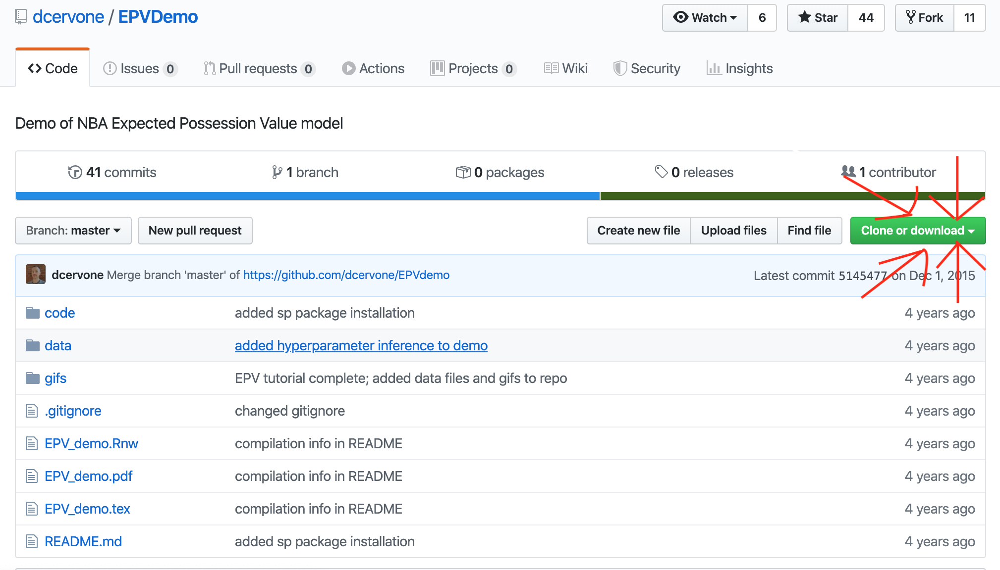
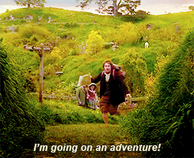

```{r setup, include=FALSE}
options(htmltools.dir.version = FALSE)
```

class: center

# Stumblng into data-driven curiosity

.center[]

---
class: center

# Thankfully, the authors shared R code

.center[]

---
class: center

# Thankfully, the authors shared R code

.center[]

---

class: inverse

# NBA Optical Tracking System: STATS SportVU

.pull-left[

- Tracks 2-D locations of every player on court (x-y coordinates) as well as 3-D coordinates of ball (x,y,z coordinates).


- 25 times a second 


- 72,000 times a game


- 1 billion times a season.

]

.pull-right[

```{r, out.width = "580px", out.height = "300px", echo = FALSE}
knitr::include_graphics("img/sportvu-demo.gif")
```


]

---

# Expected Possession Value (EPV)

--

- **Multi-resolution model**

--

- Macrotransition & Microtransition models are **combined** to account for discrete and continuous nature of the sport

--

- _Macrotransition_: passes, shots, turnovers. 

--


- _Microtransition_: every other movement that players make with ball.   

--

<br>

```{r, echo = FALSE}
knitr::include_graphics("img/epv-equation.png")
```


---

# Static image that could be animated!

.center[]

---

# Static image that is now gg-animated!


.center[]


---

# Let's dig into the code


```{r, out.width = "380px", out.height = "300px", echo = FALSE}

```

---

# Future Work


.pull-left[


```{r, out.width = "270px", out.height = "300px", echo = FALSE}
knitr::include_graphics("img/shiny-app.png")
```

]


.pull-right[

- Improve usability by allowing for _interactivity_

- Real-time rendering of animation(?)

- **Your** Suggestions?

]

---


# Resources

- [GitHub Repo](https://github.com/dcervone/EPVDemo)

- [Paper + Video of Presentation](http://www.sloansportsconference.com/content/pointwise-predicting-points-and-valuing-decisions-in-real-time-with-nba-optical-tracking-data/)

- [Preliminary Talk by Author](https://www.youtube.com/watch?v=2fYa7M_H3S4)

- [Theoretical Paper](https://arxiv.org/pdf/1408.0777.pdf)

- [Presentation of Grammar of Animation](https://www.youtube.com/watch?v=21ZWDrTukEs)

- [Intro to gganimate](https://www.youtube.com/watch?v=3UY7Or0v_dI)


---

# Thank You!

<a href="https://twitter.com/howard_baek"><i class="fa fa-twitter fa-fw"></i>&nbsp; @howard_baek</a><br>
<a href="https://github.com/howardbaek"><i class="fa fa-github fa-fw"></i>&nbsp; @howardbaek</a><br>

#### Slides created via the R package [**xaringan**](https://github.com/yihui/xaringan).
