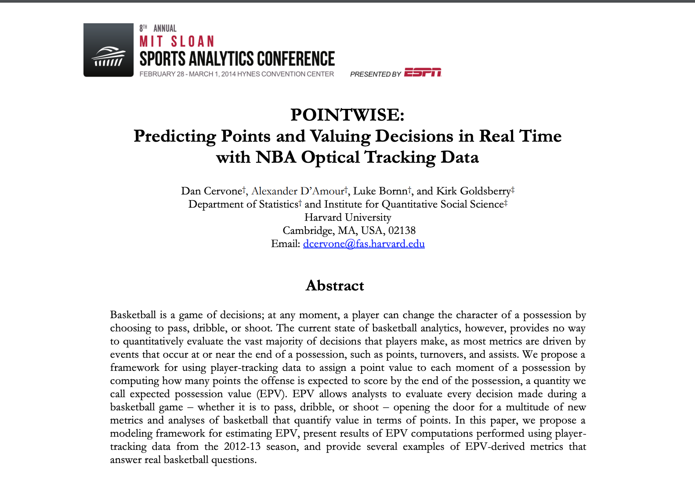
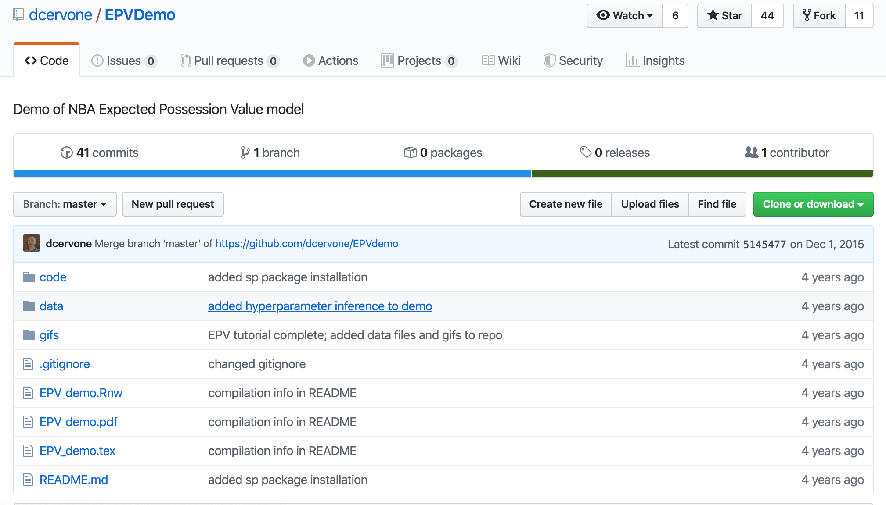
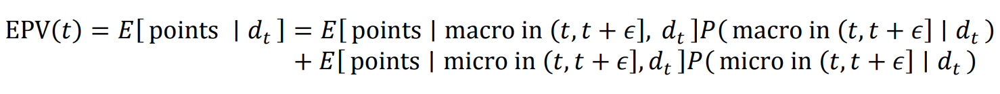
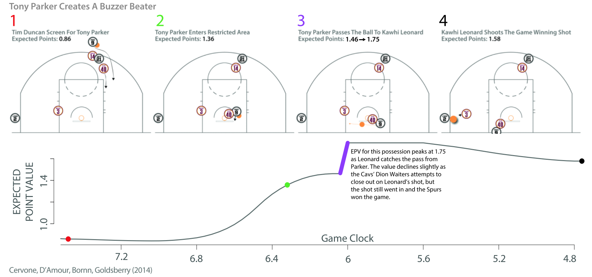
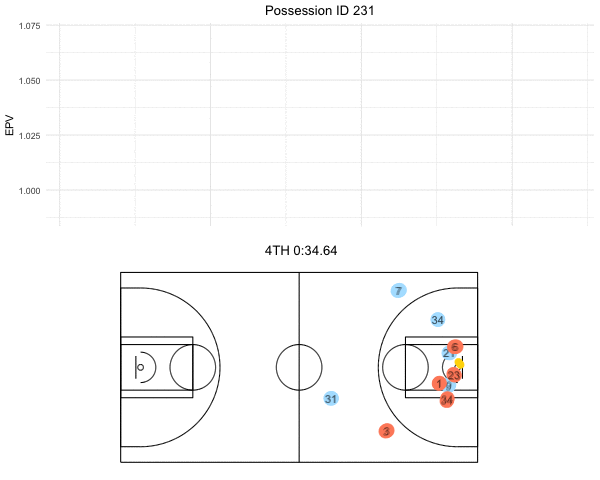

```{r setup, include=FALSE}
options(htmltools.dir.version = FALSE)
```


# Agenda

- Introduction to Expected Possession Value (EPV)

--


- Introduction to gganimate

--

- R Code behind the animations

--

- Resources

---

class: center

# Stumbling into data-driven curiosity

.center[]

---
class: center

# Thankfully, the authors shared R code

.center[]

---

class: center,inverse

# NBA Optical Tracking System: STATS SportVU


```{r, out.width = "580px", out.height = "300px", echo = FALSE}
knitr::include_graphics("img/sportvu-demo.gif")
```

---

# Expected Possession Value (EPV)

--

- **Multi-resolution model**

--

- Macrotransition & Microtransition models are **combined** to account for discrete and continuous nature of the sport

--

- _Macrotransition_: passes, shots, turnovers. 

--


- _Microtransition_: every other movement that players make with ball.   

--

<br>

```{r, echo = FALSE}

```


--

<br>

- Learn more: ["A Multiresolution Stochastic Process Model for
Predicting Basketball Possession Outcomes"](https://arxiv.org/pdf/1408.0777.pdf)


---

# Static image that could be animated!

.center[]

---

# Static image that is now gg-animated!


.center[]


---


# gganimate


.pull-left[

<br>

- Extends `ggplot2` with a grammar of animations


- `transition_*()` : defines how a layers should be interpreted in animation

- Secondary Functions: `view_*()`, `shadow_*()`, `enter_*()`/`exit_*()`,`ease_aes()`


]

.pull-right[

```{r, out.width = "280px", out.height = "300px", echo = FALSE}
knitr::include_graphics("img/gganimate_logo.png")
```


]


---

<br>
<br>
<br>
<br>

.center[]

---


# Resources

- [Original R Code](https://github.com/dcervone/EPVDemo)

- [POINTWISE](http://www.sloansportsconference.com/content/pointwise-predicting-points-and-valuing-decisions-in-real-time-with-nba-optical-tracking-data/)

- [Preliminary Talk by Author](https://www.youtube.com/watch?v=2fYa7M_H3S4)

- [Theory Paper](https://arxiv.org/pdf/1408.0777.pdf)

- [Presentation of Grammar of Animation](https://www.youtube.com/watch?v=21ZWDrTukEs)


---

class:center

# Thank You


```{r, out.width = "280px", out.height = "300px", echo = FALSE}
knitr::include_graphics("img/thank-you-2.gif")
```


<a href="https://twitter.com/howard_baek"><i class="fa fa-twitter fa-fw"></i>&nbsp; @howard_baek</a><br>
<a href="https://github.com/howardbaek"><i class="fa fa-github fa-fw"></i>&nbsp; @howardbaek</a><br>

<br>

<br>

#### Slides created via the R package [**xaringan**](https://github.com/yihui/xaringan).
